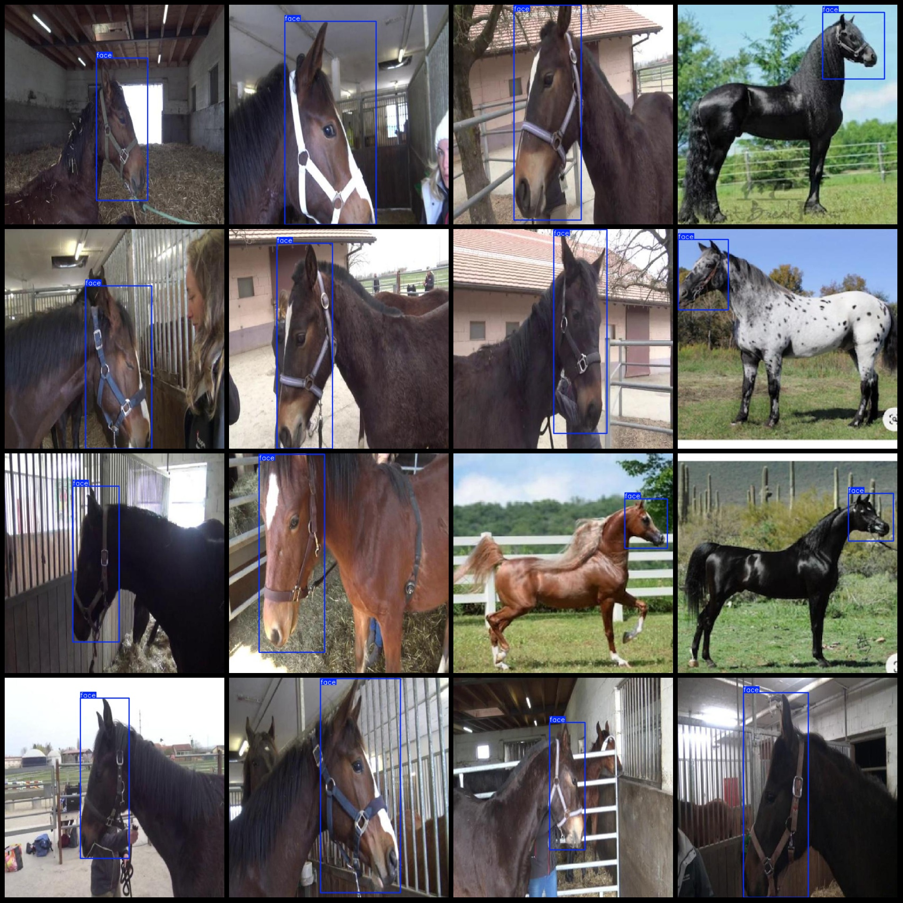
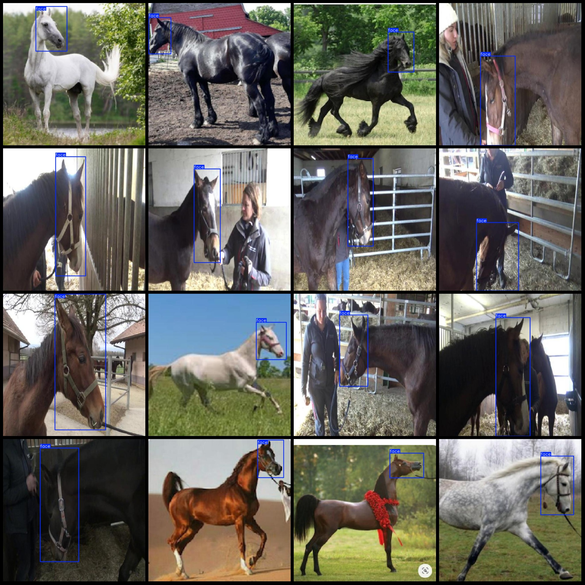

# Face Detection Dataset in VOC+YOLO format, 2656 images in 1 category

This dataset is in the Pascal VOC format with YOLO format. The images are in JPG format and the corresponding VOC and YOLO format text files are also included. The number of images, annotations, and categories are as follows:

- Image count (JPG file count): 2656
- Annotation count (XML file count): 2656
- Annotation count (txt file count): 2656
- Number of categories: 1
- Category name: ["face"]
- Box count for each category:  
  face box count = 2867
- Total boxes: 2867
- Number of images per category:  
  face images count = 2656
- Image resolution: 640x640
- Tool used for labeling: labelImg
- Labeling rule: draw bounding boxes for categories
- Special notice: The dataset does not have a training/validation/test split; you need to divide it yourself.
- Special notice: This dataset does not guarantee the accuracy of the trained models or weight files.
- Preview of images:

Here is a pay link on Stripe ( https://buy.stripe.com/3cs8yP7sY87d0vu9AB ). Please contact me lonlonago@foxmail.com after funding $89, and I will send you a complete data files , thank you!

